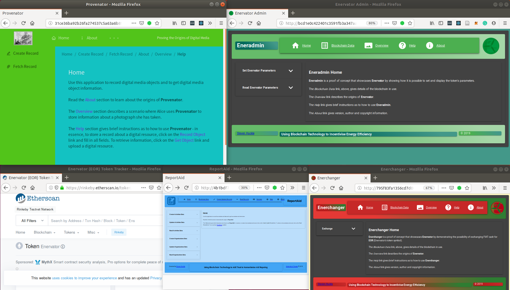
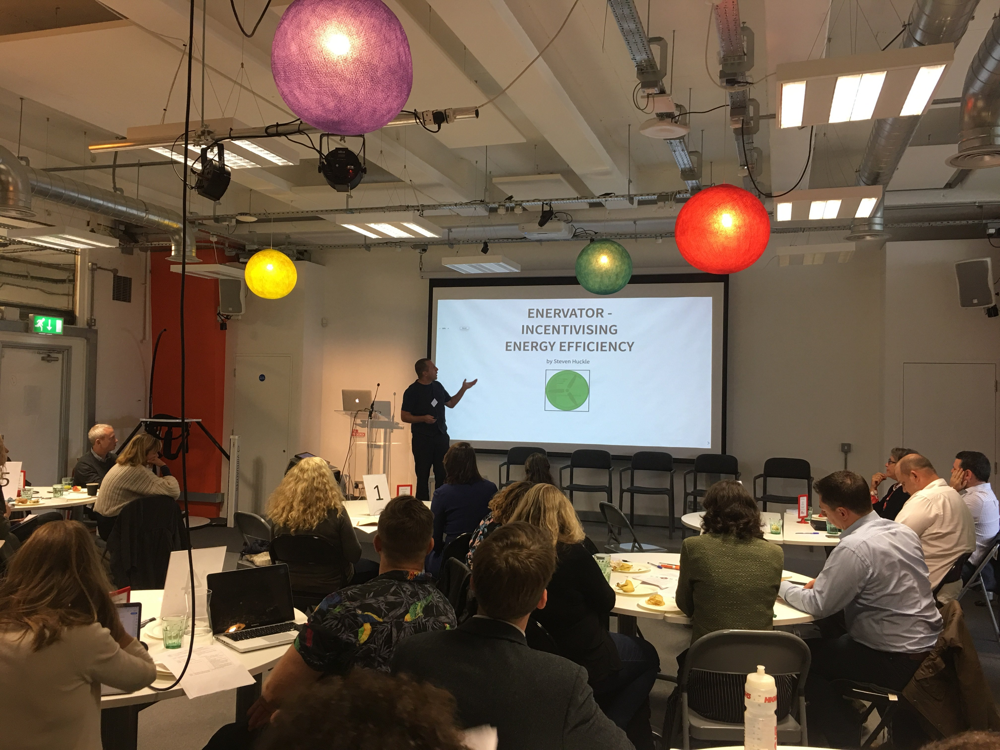
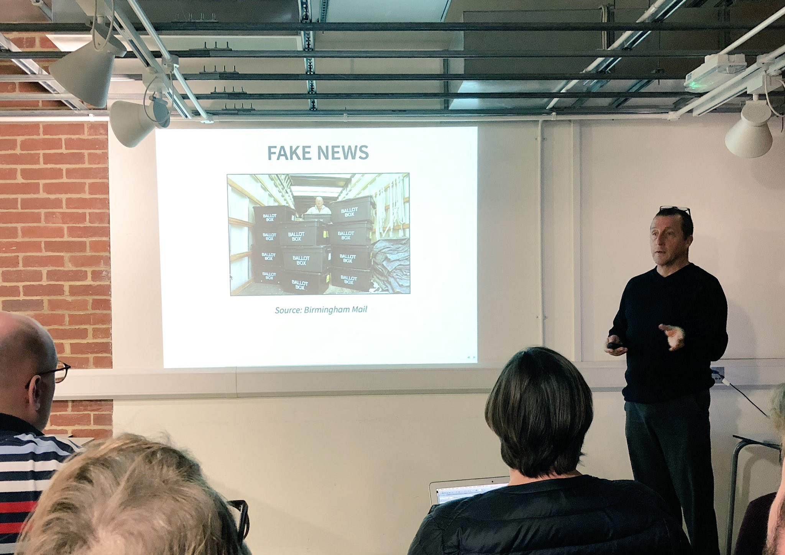

A list of works produced during Steven Huckle's PhD at the [University of Sussex](http://www.sussex.ac.uk/). Some of the text and images shown below borrow excerpts from that work.

## Software

[Enervator](https://github.com/glowkeeper/Enervator) (EOR) is a proposal for a cryptocurrency that incentivises energy efficiency and Eneradmin and Enerchanger showcase [Enervator](https://github.com/glowkeeper/Enervator) and demonstrate the exchange of a sovereign currency for a cryptocurrency. [Provenator](https://github.com/glowkeeper/Provenator) creates provenance metadata that verifies the authorship and rights of digital media. [ReportAid](https://github.com/glowkeeper/ReportAid) is a blockchain-based humanitarian aid reporting application.

### Cryptocurrency Token

| Token | Description | Rinkeby Test Network Address |
|:-----|:-------------|:-----------------------------|
| [Enervator](https://github.com/glowkeeper/Enervator) | A cryptocurrency that incentivises energy efficiency | [0x5483b2996bba07330e188fe10bb101d4c1ac8530](https://rinkeby.etherscan.io/token/0x5483b2996bba07330e188fe10bb101d4c1ac8530) |

### Applications

To load the app's below, you will need to be running [Firefox](https://www.mozilla.org/) with the [Dat P2P Protocol](https://addons.mozilla.org/en-GB/firefox/addon/dat-p2p-protocol/) and [MetaMask](https://metamask.io/) extensions installed. [MetaMask](https://metamask.io/) should be pointing at the Rinkeby Test Network, and you will need a few test Ether in your [MetaMask](https://metamask.io/) wallet - you can get those from the [Rinkeby Faucet](https://faucet.rinkeby.io/).

| App' | Description | URL |
|:-----|:------------|:-----------------------------|
| Eneradmin | Manages the supply of [EOR](https://rinkeby.etherscan.io/token/0x5483b2996bba07330e188fe10bb101d4c1ac8530/) and allows the setting and reading of the token's value parameters | [http://bcd1e0c422401c3591fb3a347aaa0d73b7faff797a21b15edabf0ca214157ccb](http://bcd1e0c422401c3591fb3a347aaa0d73b7faff797a21b15edabf0ca214157ccb/) |
| Enerchanger | Simulates depositing cash and buying [EOR](https://rinkeby.etherscan.io/token/0x5483b2996bba07330e188fe10bb101d4c1ac8530/) | [http://795f83fa1356cd7d00e5cfe8f1a93f32c55127684c6fc4cb8ff89a32e000016b](http://795f83fa1356cd7d00e5cfe8f1a93f32c55127684c6fc4cb8ff89a32e000016b/) |
| [ReportAid](https://github.com/glowkeeper/ReportAid) | A blockchain-based tool for humanitarian aid reporting | [http://4b1bdf7b0f6beeadab5dadaf019cddbc94f618792ea30b8a2f5d957267d5bd92/](http://4b1bdf7b0f6beeadab5dadaf019cddbc94f618792ea30b8a2f5d957267d5bd92/) |
| [Provenator](https://github.com/glowkeeper/Provenator) | A prototype distributed application (dApp) for proving the origins of captured digital media | [http://31ce36ba92b26fa274537c5a63a6b895bdaddb6621a675ec616dbc17c01e5ee9](http://31ce36ba92b26fa274537c5a63a6b895bdaddb6621a675ec616dbc17c01e5ee9/) |

## Published Journal Papers

| Title | Date Published | Publisher | Where | DOI |
|:------|:---------------|:----------|:------|:----|
| [Fake News - a Technological Approach to Proving Provenance Using Blockchains](https://doi.org/10.1089/big.2017.0071)   | December, 2017 | Mary Ann Liebert | Special Issue on Computational Propaganda and Political Big Data, Volume 5, Issue 4, Pages 356-371 | [10.1089/big.2017.0071](https://doi.org/10.1089/big.2017.0071) |
| [Towards a post-cash society: An application to convert fiat money into a cryptocurrency](http://firstmonday.org/ojs/index.php/fm/article/view/7410/6003 "Towards a post-cash society") |  6th March, 2017 | First Monday | Volume 22, Number 3, March 6 2017 | [10.5210/fm.v22i3.7410]( http://dx.doi.org/10.5210/fm.v22i3.7410 "10.5210/fm.v22i3.7410") |
| [Socialism and the Blockchain]( http://www.mdpi.com/1999-5903/8/4/49 "Socialism and the Blockchain") | 18th October, 2016 | MDPI | Future Internet 2016, 8(4), 49 | [10.3390/fi8040049](http://dx.doi.org/10.3390/fi8040049 "10.3390/fi8040049") |

## Published Conference Papers

| Title | Date Published | Publisher | Where | DOI |
|:------|:---------------|:----------|:------|:----|
| [Internet of Things, Blockchain and Shared Economy Applications](http://dx.doi.org/10.1016/j.procs.2016.09.074 "Internet of Things, Blockchain and Shared Economy Applications") | 22nd September, 2016 | Elsevier | Procedia Computer Science, Volume 98, 2016, Pages 461–466 | [10.1016/j.procs.2016.09.074]( http://dx.doi.org/10.1016/j.procs.2016.09.074 "10.1016/j.procs.2016.09.074") |

## Published Independent Media Articles

| Title | Date Published | Publisher |
|:------|:---------------|:----------|
| [Bitcoin’s high energy consumption is a concern – but it may be a price worth paying](https://theconversation.com/bitcoins-high-energy-consumption-is-a-concern-but-it-may-be-a-price-worth-paying-106282) | 7th November, 2018 | [The Conversation](https://theconversation.com/uk) |

## Public Speaking

| Title | Info' | Date | Where | Presentation |
|:------|:------|:-----|:------|:-------------|
| _Enervator - Incentivising Energy Efficiency_ | A talk introducing [Enervator](https://github.com/glowkeeper/Enervator), a cryptocurrency that incentivises energy efficiency | 4th October, 2019 | Innovation forum, Energy Services Business Models, held by the [UK Centre for Research into Energy Demand Solutions](http://www.sussex.ac.uk/spru/research/projects/creds) at [The Fusebox, Brighton](https://thefuseboxbrighton.com/) | [Enervator - Incentivising Energy Efficiency](https://github.com/glowkeeper/innovationForum/blob/master/presentation/Enervator.md) |
| _Beyond CryptoCurrencies_ | A talk on three of the applications that formed part of Steven's PhD ([ReportAid](https://github.com/glowkeeper/ReportAid), [Provenator](https://github.com/glowkeeper/Provenator) and [MicroMorpher](https://github.com/glowkeeper/Micromorpher)) | 4th June, 2019  | [Brighton Blockchain Meetup](https://www.meetup.com/Brighton-Blockchain-Meetup/), at [The Walrus](https://www.thewalrusbrighton.com/) | [Beyond CryptoCurrencies](https://github.com/glowkeeper/blockchainMeetup/blob/master/presentation/beyondCryptos.md) |
| _Fake News - a Technological Approach to Proving Provenance Using Blockchains_ | A talk on fake news and blockchains, as part of the [University of Sussex Library's Digital Discovery Week](http://www.sussex.ac.uk/library/about/digital) | 9th November, 2018  | University of Sussex Library's Open Space | [Digital Discovery Week Presentation](https://github.com/glowkeeper/digitalDiscoveryPresentation/blob/master/presentation/digitalDiscovery.md) |
| _Collaborating Through Blockchains_ | Part of a PhD Symposium at the University of Sussex's Informatics Department | 3rd July, 2018 | Chichester Lecture Theatre at the University of Sussex | A similar talk to that given at Sussex's _Three Minute Thesis_, detailed below. |
| _Investigating How Blockchain Technology is a Means by Which Communities Can Collaborate_ | Here, Steve gave a three-minute _laymens overview_ of his PhD as part of the University of Sussex's [Three Minute Thesis (3MT)](http://www.sussex.ac.uk/internal/doctoralschool/researcherdev/threeminthesis) | 27th June, 2018 | [Attenborough Centre for the Creative Arts](https://www.attenboroughcentre.com/) | [3MT Presentation](https://glowkeeper.github.io/3MT-of-Steve-Huckle/) |
| _[Introduction to Blockchain Application Development](https://www.eventbrite.co.uk/e/intro-to-blockchain-application-development-for-beginners-tickets-42564510597#)_ | A three-hour overview of the components of blockchain application development | 19th March, 2018 | [Wired Sussex](https://www.wiredsussex.com/) at the [Digital Catapult, Brighton](https://www.digitalcatapultcentre.org.uk/local-centre/brighton/) | [Introduction to Blockchain Application Development](https://github.com/glowkeeper/dApp-Development) |
| _Internet of Things and Blockchain Technology_ | A twenty-minute overview of blockchains and the Internet of Things | 22nd September, 2016 | [Smart Summit London](http://www.iotsmartsummitlondon.com/ "Smart Summit London"), Kensington Olympia | [Internet of Things and Blockchain Technology](https://github.com/glowkeeper/DaMIS-Presentation) |
| _Internet of Things, Blockchain and Shared Economy Applications_ | An overview of some of the concepts introduced in the paper [Internet of Things, Blockchain and Shared Economy Applications](http://dx.doi.org/10.1016/j.procs.2016.09.074 "Internet of Things, Blockchain and Shared Economy Applications") | 20th September, 2016 | [EUSPN 2016, DaMIS Workshop](http://143.225.211.50/damis/ "DaMIS"): International Workshop on Data Mining on IoT Systems, University of Surrey | [Internet of Things and Blockchain Technology](https://github.com/glowkeeper/DaMIS-Presentation) |
| _Blockchain Technology_ | Overview of blockchains, given at the launch of the [Creative Technology Group](http://www.sussex.ac.uk/creativetechnology/) at the [University of Sussex](http://www.sussex.ac.uk/) | 9th May, 2016 | Launch of the [Creative Technology Group](http://www.sussex.ac.uk/creativetechnology/) at the [University of Sussex](http://www.sussex.ac.uk/) | [Blockchain Technology and the Internet of Things](https://github.com/glowkeeper/Creative-Technology-Group-Blockchain-Presentation) |
| _Evaluating Bitcoin as an Open Source Project_ | A presentation given to the students on the University of Sussex's Science Policy Research Unit's MSc Module, _ICT Policy and Strategy_ | 6th May, 2016 | [University of Sussex](http://www.sussex.ac.uk/) seminar on [Information and Communication Technology Policy and Strategy](http://www.sussex.ac.uk/bmec/internal/departments/spru/pgcourses/2016/L1520T/62854) | [Evaluating Bitcoin as an Open Source Project](https://github.com/glowkeeper/Bitcoin-Presentation) |

_Enervator - Incentivising Energy Efficiency Innovation forum, Energy Services Business Models, held by the [UK Centre for Research into Energy Demand Solutions](http://www.sussex.ac.uk/spru/research/projects/creds) at [The Fusebox, Brighton](https://thefuseboxbrighton.com/)_

_Fake News and Blockchains at the University of Sussex's Digital Discovery Week_

_Introduction to Blockchain Application Development at [Wired Sussex](https://www.wiredsussex.com/)_

## Poster Presentations

| Poster | Date | Where |
|:-------|:-----|:------|
| [Are Blockchains the Means By Which We Can Collaborate?](/docs/poster120717.pdf) | Wednesday 12th July, 2017  | Chichester 1, [University of Sussex](http://www.sussex.ac.uk/) |

## Training

| Title | Date | Where |
|:------|:-----|:------|
| Blockchain Development for Shared Economy Applications | 5th December, 2016 | American Express, Burgess Hill |

## Lectures

| Title | Date | Where |
|:------|:-----|:------|
| Topics in Computer Science (Blockchain Development for Shared Economy Applications) | 4 x 1 hour lectures on 28/11/16, 1/12/16, 5/12/16 and 8/12/16 | [University of Sussex](http://www.sussex.ac.uk/) |

Copyright © Steven Huckle, 2016-2018.

 
Unless otherwise stated, the works here are licensed under a [Creative Commons Attribution-NonCommercial-ShareAlike 4.0 International License](https://creativecommons.org/licenses/by-nc-sa/4.0/) (CC BY-NC-SA 4.0). They are attributed to Steven Huckle. The license lets you remix, tweak, and build upon the work non-commercially, as long as you credit Steven Huckle and license your new creations under identical terms.
