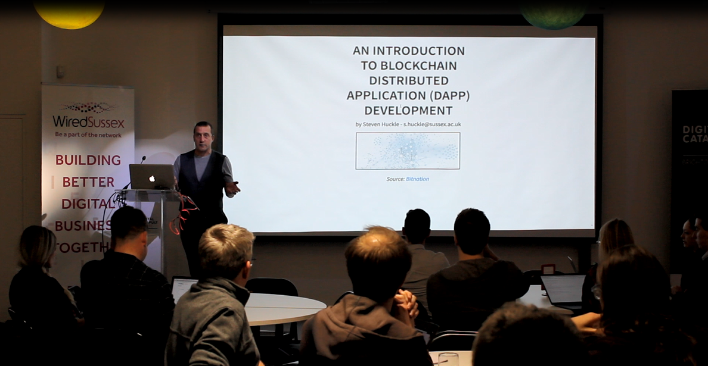
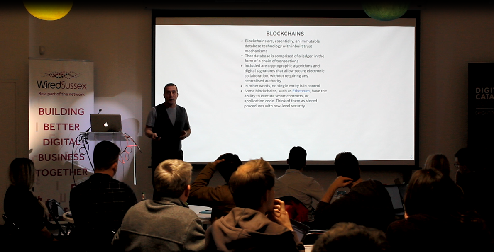
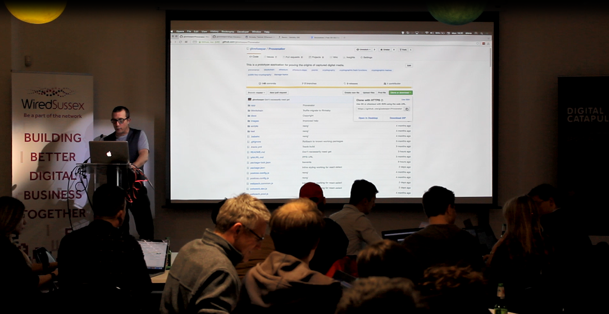

A list of works produced during my PhD at the [University of Sussex](http://www.sussex.ac.uk/).

## Invited Talks

| Title | Info' | Date | Where | Presentation |
|:------|:------|:-----|:------|:-------------|
| _Collaborating Through Blockchains_ | Part of a PhD Symposium at the University of Sussex's Informatics Department | 3rd July, 2018 | Chichester Lecture Theatre at the University of Sussex | I gave the same talk I gave at Sussex's _Three Minute Thesis_, detailed below. |
| _Investigating How Blockchain Technology is a Means by Which Communities Can Collaborate_ | Here, I gave a a three-minute _laymens overview_ of my PhD as part of the University of Sussex's [Three Minute Thesis (3MT)](http://www.sussex.ac.uk/internal/doctoralschool/researcherdev/threeminthesis) | 27th June, 2018 | [Attenborough Centre for the Creative Arts](https://www.attenboroughcentre.com/) | [3MT Presentation](https://glowkeeper.github.io/3MT-of-Steve-Huckle/) |
| _[Introduction to Blockchain Application Development](https://www.eventbrite.co.uk/e/intro-to-blockchain-application-development-for-beginners-tickets-42564510597#)_ | A three-hour overview of the components of blockchain application development | 19th March, 2018 | [Wired Sussex](https://www.wiredsussex.com/) at the [Digital Catapult, Brighton](https://www.digitalcatapultcentre.org.uk/local-centre/brighton/) | _[Introduction to Blockchain Application Development](https://github.com/glowkeeper/dApp-Development)_ |
| _Internet of Things and Blockchain Technology_ | A twenty-minute overview of blockchains and the Internet of Things | 22nd September, 2016 | [Smart Summit London](http://www.iotsmartsummitlondon.com/ "Smart Summit London"), Kensington Olympia | [Internet of Things and Blockchain Technology](https://github.com/glowkeeper/DaMIS-Presentation) |
| _Internet of Things, Blockchain and Shared Economy Applications_ | An overview of some of the concepts introduced in my paper [Internet of Things, Blockchain and Shared Economy Applications](http://dx.doi.org/10.1016/j.procs.2016.09.074 "Internet of Things, Blockchain and Shared Economy Applications") | 20th September, 2016 | [EUSPN 2016, DaMIS Workshop](http://143.225.211.50/damis/ "DaMIS"): International Workshop on Data Mining on IoT Systems, University of Surrey | [Internet of Things and Blockchain Technology](https://github.com/glowkeeper/DaMIS-Presentation) |
| _Blockchain Technology_ | Overview of blockchains, given at the launch of the [Creative Technology Group](http://www.sussex.ac.uk/creativetechnology/) at the [University of Sussex](http://www.sussex.ac.uk/) | 9th May, 2016 | Launch of the [Creative Technology Group](http://www.sussex.ac.uk/creativetechnology/) at the [University of Sussex](http://www.sussex.ac.uk/) | [Blockchain Technology and the Internet of Things](https://github.com/glowkeeper/Creative-Technology-Group-Blockchain-Presentation) |
| _Evaluating Bitcoin as an Open Source Project_ | A presentation given to the students on the University of Sussex's Science Policy Research Unit's MSc Module, _ICT Policy and Strategy_ | 6th May, 2016 | [University of Sussex](http://www.sussex.ac.uk/) seminar on [Information and Communication Technology Policy and Strategy](http://www.sussex.ac.uk/bmec/internal/departments/spru/pgcourses/2016/L1520T/62854) | [Evaluating Bitcoin as an Open Source Project](https://github.com/glowkeeper/Bitcoin-Presentation) |

### Photos from the Invited Talks

_Introducing the Workshop at Wired Sussex_

_A Brief Overview of Blockchains at the Wired Sussex Workshop_

_Introducing Distributed App' (dApp) Development at the Wired Sussex Workshop_

## Published Journal Papers

| Title | Date Published | Publisher | Where | DOI |
|:------|:---------------|:----------|:------|:----|
| [Fake News - a Technological Approach to Proving Provenance Using Blockchains](https://doi.org/10.1089/big.2017.0071)   | December, 2018 | Mary Ann Liebert | Special Issue on Computational Propaganda and Political Big Data, Volume 5, Issue 4, Pages 356-371 | [10.1089/big.2017.0071](https://doi.org/10.1089/big.2017.0071) |
| [Towards a post-cash society: An application to convert fiat money into a cryptocurrency](http://firstmonday.org/ojs/index.php/fm/article/view/7410/6003 "Towards a post-cash society") |  6th March, 2017 | First Monday | Volume 22, Number 3, March 6 2017 | [10.5210/fm.v22i3.7410]( http://dx.doi.org/10.5210/fm.v22i3.7410 "10.5210/fm.v22i3.7410") |
| [Socialism and the Blockchain]( http://www.mdpi.com/1999-5903/8/4/49 "Socialism and the Blockchain") | 18th October, 2016 | MDPI | Future Internet 2016, 8(4), 49 | [10.3390/fi8040049](http://dx.doi.org/10.3390/fi8040049 "10.3390/fi8040049") |

## Published Conference Papers

| Title | Date Published | Publisher | Where | DOI |
|:------|:---------------|:----------|:------|:----|
| [Internet of Things, Blockchain and Shared Economy Applications](http://dx.doi.org/10.1016/j.procs.2016.09.074 "Internet of Things, Blockchain and Shared Economy Applications") | 22nd September, 2016 | Elsevier | Procedia Computer Science, Volume 98, 2016, Pages 461–466 | [10.1016/j.procs.2016.09.074]( http://dx.doi.org/10.1016/j.procs.2016.09.074 "10.1016/j.procs.2016.09.074") |

## Poster Presentations

| Poster | Date | Where |
|:-------|:-----|:------|
| [Are Blockchains the Means By Which We Can Collaborate?](/docs/poster120717.pdf) | Wednesday 12th July, 2017  | Chichester 1, [University of Sussex](http://www.sussex.ac.uk/) |

## Training

| Title | Date | Where |
|:------|:-----|:------|
| Blockchain Development for Shared Economy Applications | 5th December, 2016 | American Express, Burgess Hill |

## Lectures

| Title | Date | Where |
|:------|:-----|:------|
| Topics in Computer Science (Blockchain Development for Shared Economy Applications) | 4 x 1 hour lectures on 28/11/16, 1/12/16, 5/12/16 and 8/12/16 | [University of Sussex](http://www.sussex.ac.uk/) |

Copyright © Steven Huckle, 2016-2018.

 
Unless otherwise stated, the works here are licensed under a [Creative Commons Attribution-NonCommercial-ShareAlike 4.0 International License](https://creativecommons.org/licenses/by-nc-sa/4.0/) (CC BY-NC-SA 4.0). They are attributed to Steven Huckle. The license lets you remix, tweak, and build upon the work non-commercially, as long as you credit Steven Huckle and license your new creations under identical terms.
